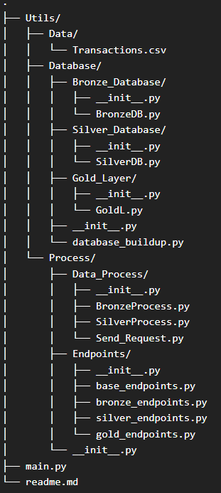

### Project's main goal is to read information from transactions.csv file Process the data into Bronze,Silver,Gold Layers and get them ready for analytical reports

# Directory

## Database Directory contains layer based PostgreSQL connections,database builds, sql queries, inserts, delete

## Process.Data_Process contains requests, reads csv file, sends api calls, main data transferring happens there

## Process.Endpoints contains api endpoints

## main.py starts the server and builds up database

# ---------------- USER MANUAL ----------------

## IMPORTANT!

### First of all move transactions.csv to Utils.Data directory

### if you are running code for the first time and have no database, uncomment database buildup section, if you need to restart the server comment that section! otherwise triggers get in conflict

### to read csv file and send it to the bronze layer, you must run the Process.Data_Process.BronzeProcess.py

### to start the data cleaning/transferring to silver layer you must run Process.Data_Process.SilverProcess.py

### If you want to end ETL processes, stop BronzeProcess.py and SilverProcess.py

# Thanks! 
